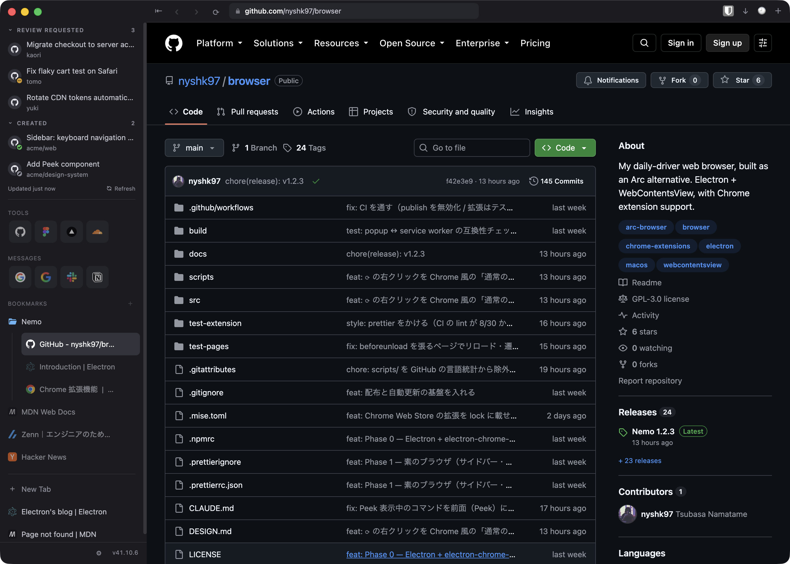

# Nemo

Arc の代替として自分用に作ったブラウザ。**2026-08 から常用している。**
Electron + `BaseWindow` + タブごとの `WebContentsView` で、Chrome 拡張（Bitwarden 等）がそのまま動く。



Arc のサイドバー（Favorites / ピン留め / 一時タブ）・コマンドバー・Peek・Split View・Live Folder・
シークレットウィンドウ・既定ブラウザ対応・アプリ内自動更新まで、乗り換えに必要なものは一通り揃えた。

## Highlights

- **Chrome 拡張（Manifest V3）がそのまま動く。** `electron-chrome-extensions` に足りない API を polyfill している。
  `chrome.storage.onChanged` は送り手 × 領域 × 受け手を総当たりで測って「受け手が service worker の経路だけ 0 件」を
  突き止めてから塞いだ
- **GitHub の Active な PR がサイドバーに自動で並ぶ（Live Folder）。** レビュー依頼と自分の未マージ PR を GraphQL 1 本で取り、
  60 秒ポーリング + ウィンドウのフォーカス時に即時更新。コストはクエリ 1 回で 1pt なので rate limit の 1〜2% に収まる。
  トークンは設定した PAT → `gh auth token` の順で解決し、端末鍵で暗号化して保存する
- **Google Meet の通話バーを自作。** 別のページやアプリに移っても通話バーが浮いたまま残る。Arc と同じく Document Picture-in-Picture を
  使うつもりだったが、Electron 41 は blink 側の API だけ生えていてウィンドウ実装が無く、サイズ 0 の document が 800ms 後に
  勝手に閉じる。そのため panel ウィンドウで組んだ（+0.8MB。中の `WebContentsView` は 1 枚 +89MB）
- **ピン留めが何十個あっても起動は軽い。** タブの実体は押した瞬間に作り、しばらく見ていないタブはメモリを解放する。
  メモリ / CPU は診断ログに定期記録していて、Arc や Chrome と並べて比べられる

## スタンス

- **個人用**。販売・配布・サポートの予定はない。Release のバイナリと Homebrew tap も自分のためのもので、他の環境で動く保証はしない
- **Issue / Pull Request は受け付けない**。自分の好みで好き勝手に変えていくので、要望や修正を取り込む前提がない
- **フォークして自分用に改造するのは自由**。ライセンスは GPL-3.0-only（依存の `electron-chrome-extensions` が GPL のため）。改造版を配布するならソース公開が条件

> **Note (English):** Personal project. No support, no issues, no pull requests.
> Fork it and make it yours — it's GPL-3.0-only.

## 使い方

```bash
mise run setup   # 依存 + 拡張 artifact を揃える
mise run dev     # 開発版を起動
```

タスク一覧は `mise tasks`。リリース・拡張・ブックマークのセーブスロットなどの運用手順は
[docs/operations.md](docs/operations.md)、設計は [docs/plans/](docs/plans/)、ライセンスの経緯は
[docs/licenses.md](docs/licenses.md) を参照。
